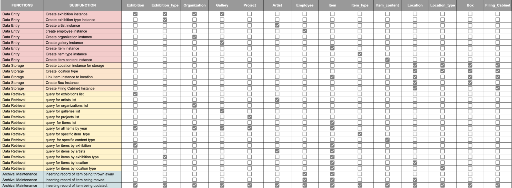
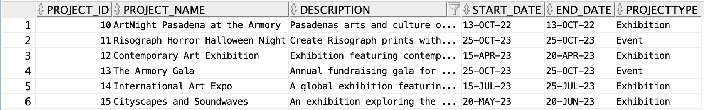
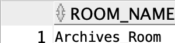

# SQL Database for Armory Archives

## Executive Summary
The relational data model developed through SQL is aimed to simplify the storage and retrieval of data from the Armory Center for the Arts in Pasadena, California. The Armory Center for the Arts, previously known as the Pasadena Art Museum opened its doors in 1947\. For nearly eight decades the Armory has hosted the work of local and distinguished artists and provided a space for the residents of Pasadena and the greater Los Angeles area. The Armory Center’s mission is,  “to nurture our community and its young people by creating, learning, and presenting art to advance equity and social justice. We envision joyful, healthy, and equitable communities shaped by imagination, creativity, and diverse voices.” The Armory Center has been an active member of their local community and has partnered with organizations that are committed to promoting youth interest in fine arts. 

Over the past decades, the Armory Center has relied on paper records to track their activity. Their current physical database includes thousands of printed documents and other media items sorted by boxes that were manually retrieved based on an unclear naming convention. Our project reorganized this data, allowing for information about artists, exhibitions and programs to be more efficiently accessible. 

The main functions of this database are centered around ensuring data storage, entry and retrieval, as the Armory Center for the Arts aims to transition their exhibition archives digitally. Using SQL, our team has created a product that will enable the Armory to quickly review the information held in their archives without having to dig through old files for hours. 

The goal of this project was to reorganize the relational model of the physical data logging system previously used to a more efficient data model that is not based on arbitrary conventions like a traditional filing structure. For example, if an artist participated in multiple exhibitions at the Armory Center, the files would be held in separate folders and likely separate boxes, requiring an employee or patron with the knowledge of both exhibits to accurately track the artist’s exhibition history. With our new SQL database, a user could simply use the name of the artist to find all the exhibitions they participated in. Our team thoughtfully crafted a first iteration of the database for the Armory Center optimizing for data storage about exhibits, events and artists who the Armory Center has recorded their connection with.

## **Planning for the Database: Practical Database Development**

To determine the scope for this project our team visited the Armory Center to view their archives. We also spoke to current employees to understand their essential business functions and deepen our understanding of typical art industry jargon. When analyzing their archives we carefully looked at the types of information they stored identifying what kinds of attributes would be necessary for the entities we created and how the entities should relate to each other based on the business rules we observed. The Armory Center for the Arts has been open for decades and has hosted hundreds of exhibitions with thousands of artists. In addition to their exhibitions, the Armory Center hosts events and classes. 

To best prepare for modeling our database we created a [function versus entity chart](https://docs.google.com/spreadsheets/d/1HDg3VvOAA6XPOCXYRCrJhA6\_TsmI\_5-gZTCut6QnQDg/edit?usp=sharing) to anticipate which entities would be needed for the functions we wanted to have in our database. This exercise allowed us to grasp the nature of the relationships we plan to build in SQL. This chart also identified the most important entities to our model and potential integrity constraints we should consider when getting to the more advanced stages of design. 

## **Conceptual Design**

### **ERD**  
Our entity relationship diagrams are interpretations of the current physical archive at the Armory Center for Arts. Below we have provided images of the physical user views. In some cases our entity relationship diagrams represent a synthesized interpretation of the Armory Center’s available user views to better translate into SQL formatting.

> **User View Example \#1**  

> **User View Example \#2**
> 

>**User View Example \#3**  
> 

>**User View Example \#4**
>

### ERD Design
>**ERD \#1**
> 

>**ERD \#2**
> 

The first ERD represents the organization of items in the format of folders and boxes of folders. Each unique folder contains items relating to the folder topic. There is a rare occasion where items are not housed in a folder. For each folder there is a box that it is held in which is labeled based on its contents. In our model each box is given a unique name and folders are categorized based on their content type, which could include artist background, budgeting or reports about attendance. Most folders hold multiple items and at minimum hold one item. This model most represents userview examples \#1 and \#3

The second ERD represents finding an item. Each item within the Armory Center’s archive may be related to a person (could be an artist or employee), organization, artwork or project. The model is most related to the second user view which indicates the contents within the box physically listed by an employee who manually identified the box contents. Due to the disorganization of the current archival system at the Armory Center, our team developed this user view using our understanding of the business practices of the arts center.

For a better viewing experience of our ERDs, we have provided a [link](https://lucid.app/lucidchart/2c5bfdc3-2144-420f-bcde-9debf61b5fc0/edit?invitationId=inv\_bc795a3a-01ce-4749-9c30-6b642d8112be) to the Lucid Chart document.

## **CDM**  
The conceptual data model integrates the entities and relationships from our individual enterprise relationship diagrams based on user views to create one composite diagram indicating how our final data model will operate. Our final conceptual data model includes 37 different entities. To smoothly combine our ERDs we created ‘lookup tables’ to support the underlying many to many relationships present between entities. Below is an image of our data model. For better viewing of our model please use this [link](https://lucid.app/lucidchart/2c5bfdc3-2144-420f-bcde-9debf61b5fc0/edit?viewport\_loc=-3423%2C-1020%2C6706%2C3422%2CtZgT3L\_.Fx-j\&invitationId=inv\_bc795a3a-01ce-4749-9c30-6b642d8112be).

## **Business Rules**  
For the purposes of this project we have adopted a few different business rules to clarify the relationships between the entities we have created. We allow a person involved with the Armory to hold multiple identities including as an artist and employee. The Armory also is connected to many different organizations, some of which are collectives or a consortium of arts organizations. The Armory currently organizes its data in a combination of locations, including physical spaces like boxes in filing cabinets as well as digital documents and media forms on Google Drive. An event or person may have data stored in many different locations both physically and digitally. For the purpose of this project an item is defined as an individual piece  of media including documents, online videos, online and physical images, cassette tapes, DVDs, CDs, etc. Additionally, our database includes the Project entity as a superclass to the Event and Exhibition entities, meaning that a project may be an event or an exhibition. Similarly, the entity Container is a super class for Box and Cabinet Location, indicating that a container can be a box or cabinet. There are two types of items in our database, either items held in folders or items that are not within folders.

Here we would like to highlight some definitions relating to the entities and attributes we created that may be less intuitive based on our naming. An item classification refers to the content type or theme of a particular item. The item type indicated the physical features of an item (i.e. printed document, cassette tape, CD). The medium represents the type of art (i.e. oil on canvas, paper mache, sculpture). The person type identifies the category of the individual this would include an artist, employee, volunteer, etc. A container is a superclass of box and cabinet and generally refers to a location that a folder or item would be housed in. Folder content describes the theme of information that is found in a folder like budget, artist background, exhibition and more.

## **Domain Definitions**  
There are a few different domain classifications within our database. Many of the primary keys of our entities like Artwork\_ID, Box\_ID, Item\_ID and Person\_ID will be a **number** domain. Other attributes that are descriptors or contain personal data are likely variable-length character string (**varchar2**) domain. This would include attributes like Person(First\_Name) and Medium(Description). The other domain frequently used in this database is **date**. This is included in entities like Item and Project that both have Start\_Date and End\_Date attributes.

## **Logical Design with the Relational Model**  
Third Normal Form Statements (3NFs)  
Key: primary key, **not null**, *foreign key,* Unique, *Subclass Alias*, Check Statements

1. Zip\_Code (Zip, **City**, **State**)  
2. Event\_Type (Event\_Type)  
3. Exhibition\_Type (Exhibition\_Type, Description)  
4. Item\_Classification (Item\_Classification, Description)  
5. Item\_Type (Item\_Type, Description)  
6. Medium (Medium, Description)  
7. Organization\_Type (OrganizationType, Description)  
8. Person\_Type (PersonType, Description)  
9. Project\_Type (ProjectType, Description)  
10. Room (Room\_Name)  
11. Container\_Type(Container\_Type, Description)  
12. Container (Container\_ID, **Container\_Name**, Description, ***Room\_Name, Container\_Type***)  
13. Filing\_Cabinet (*Cabinet\_ID,* Description*, **Room\_Name***)  
14. Folder\_Content (Folder\_Content, Description)  
15. Organizations (Organization\_ID, **Organization\_Name**, Street\_Address, *Zip*, Phone\_Number, Email)  
16. Person (Person\_ID, **First\_Name**, Middle\_Name, **Last\_Name**, Email, Phone, Shipping\_Address, *Zip*)  
17. Box (Box\_ID, Start\_Date, End\_Date, Archive\_Date)  
18. Folder (Folder\_ID, **Folder\_Name**, Description, ***Folder\_Content***, ***Container\_ID***)  
19. Item (Item\_ID, **Item\_Name**, Description, Start\_Date, End\_Date, ***Item\_Type***, ***Item\_Classification***)  
20. Art\_Work (ArtWork\_ID, **Name**, Description, Date\_Created, ***Medium***)  
21. Project (Project\_ID, **Project\_Name**, Description, Start\_Date, End\_Date, ***ProjectType***)  
22. Exhibition (Exhition\_ID, ***Exhibition\_Type***)  
23. Person\_Role (PersonRole\_ID, ***(Person\_ID, PersonType)***)  
24. Event (Event\_ID, *Exhibition\_ID*, ***Event\_Type***)  
25. Cabinet\_Location *(CabinetLocation\_ID*, (**Row\_Number, *Cabinet\_ID* )**, Description)  
26. Foldered\_Item (*Item\_ID*, ***Folder\_ID***)  
27. Folderless\_Item (*Item\_ID*, ***Container\_ID***)  
28. Person\_Item (*Person\_ID*, *Item\_ID*)  
29. Organization\_Item (*Organization\_ID*, *Item\_ID*)  
30. Project\_Item (*Project\_ID*, *Item\_ID*)  
31. ArtWork\_Item (*Artwork\_ID*, *Item\_ID*)  
32. Project\_ArtWork (*Project\_ID*, *ArtWork\_ID*)  
33. Organization\_Role (OrganizationRole\_ID, (***Organization\_ID***, ***Organization\_Type***), Description)  
34. ArtWork\_Organization (*ArtWork\_ID*, *OrganizationRole\_ID*, Description)  
35. Project\_Organization (*Project\_ID*, *OrganizationRole\_ID*, Description)  
36. Artwork\_Personnel (*ArtWork\_ID*, *PersonRole\_ID*, Description)  
37. Project\_Personnel (*PersonRole\_ID*, *Project\_ID*, Description)

Our third normal form statements have noted particular entities that require additional check statements in the physical implementation of our design in order to protect the integrity of the data. These will enforce basic business rules like ensuring the start date of a project is before the end date of a project. In our key, all primary keys are assumed to be unique so they are not additionally labeled in red font. To be clear about the naming convention of our attributes we also noted the instances when a subclass’ primary key (which is the same as its superclass primary key) is named with an ‘alias’ that may fit better with the subclass entity’s naming convention. 

## **Physical Design and Implementation with the Relational Model**

## **Process versus Entity Matrix**  
The process versus entity matrix represents our analysis of the anticipated usage of our database, measuring the creates, reads, updates and deletes of each entity based on the processes that will occur in the database. I have provided a link to the excel sheet for our [process versus entity matrix](https://uscedu-my.sharepoint.com/:x:/g/personal/npoe\_usc\_edu/EUD8QKGOAv9OpwHhQlfCzI8BbBc03vg1j-3hmxqQCtV4RA?e=bnKbzp).

## **Transaction Analysis Forms**  
Our transaction analysis forms are used to track each entity affected by a particular function modeled in our database. Each entity included in the form has a particular action tied to it (create, update, read or delete) and an estimated number of times this action occurs per transaction. These numbers are then multiplied by the peak number of transactions (estimated by our team) to find the total number of references per period. Below is a sample TAF for creating an item stored in a folder. All of our transaction analysis forms can be found using this [link](https://uscedu-my.sharepoint.com/:x:/g/personal/npoe\_usc\_edu/EZohStf3MABIsljXejG42xcBRs0\_fpyJLrhzYUWadkLM6A?e=qJ2N6X).

## **Composite Usage Map**  
  
This composite usage map combines the transaction analysis forms we created to indicate the anticipated usage of each entity in relation to the processes we highlighted. Each entity has numbers indicating the total number of hits, its percentage of database hits and CUD/CRUD ratio.

## **Summary of Physical Design**  
Our database includes the following triggers and clusters to optimize data retrieval and improve the integrity of our design. Several of our triggers were created to enforce subclass relationships. There are subclasses for the Project, Container and Item. Our cluster statements are included to improve data retrieval for information we anticipate to be frequently viewed, like the people related to an exhibition. The naming conventions of our data we inherited from the Armory Center’s archive is not always unique. To simplify this issue we included sequence statements to create artificial primary keys for many of our entities including Person, Project, Organization, Item, Container, Folder, Organization Role and Person Role. Our indexes were created based on the process versus entity matrix to determine which attributes should be optimally indexed for the best possible performance of our database. We also indexed foreign keys. Some of the attributes we would’ve indexes are already indexed because they have unique constraints. See in-line notes for further details about the triggers, clusters, indexes and sequences in our code.

## **Summary and Conclusions**

Our final data model aims to simplify the process of entering and retrieving data for the Armory Center for the Arts. Due to the database’s archival nature, we anticipate that the majority of the usage of this database will be for reads. The architecture of our database is structured to best support the expected usage behaviors. 

One of the biggest challenges in creating this database was determining our business rules. This required hands-on research through visits to the Armory Center as well as independent research to understand the art terminology and industry practices. Understanding the architecture of an organization like the Armory enhances our ability to produce an efficient database that mimics the behavior and practices of the employees who will ultimately be using our final product.

One of the team’s favorite aspects of the database is enhanced ability to track items. Previously, all items had to be manually retrieved and most items were only identified by the box and folder they are held in. With our database, items can be searched for based upon the item type (the physical nature of the item), item classification (the content nature of the item), the type of content it is held in and its relation to a project, person, piece of artwork or organization. Currently most of the boxes are sorted by year or exhibition, if there was one artist who was involved in multiple exhibitions over different years an employee would have to locate each box and have previous knowledge of which exhibits the artist participated in to find the items they were looking for. Now if an employee wants to find all items relating to an artist they can easily perform a search to retrieve each item relating to that particular person. 

As our first iteration of the database, there are a few functions we would like to add in the future to enhance the user experience, particularly about the non-central functions of the Armory Center. While we focused on the archival aspect of the Armory Center they are an active member of the local community and creating a process on the database to track more of their participation would be an element to further improve our database. Additionally, tracking the location of an item relies on the employees retaining the physical location after use. For example, if an employee extracted a file from a box and placed it inside a new box there is no way to combat physical dislocation. Luckily our database will store the correct location information so in the case this occurs an employee will know where an item should be stored. 

## **Data Tables**  
The following images represent the data for each table we have created. Due to our process modeling the database using the sequence function

Art\_Work  

Artwork\_Item  

Artwork\_Organization  

Artwork\_Personnel  

Box  

Cabinet\_Location  

Container  

Containter\_Type  

Event  

Event\_Type  

Exhibition  

Exhibition\_Type   

Filing\_Cabinet  

Folder  

Folder\_Content  

Foldered\_Item  

Folderless\_Item  

Item  

Item\_Classification  

Item\_Type  

Medium  

Organization\_Item  

Organization\_Role  
  
Organization\_Type  

Organizations  

Person  

Person\_Item  

Person\_Role  

Person\_Type  

Project  

Project\_Artwork  

Project\_Item  

Project\_Organization  

Project\_Personnel  

Project\_Type  

Room  

Zip\_Code  

## Team
- Benjamin Byun
- Natalie Poe
- Peter Ma
